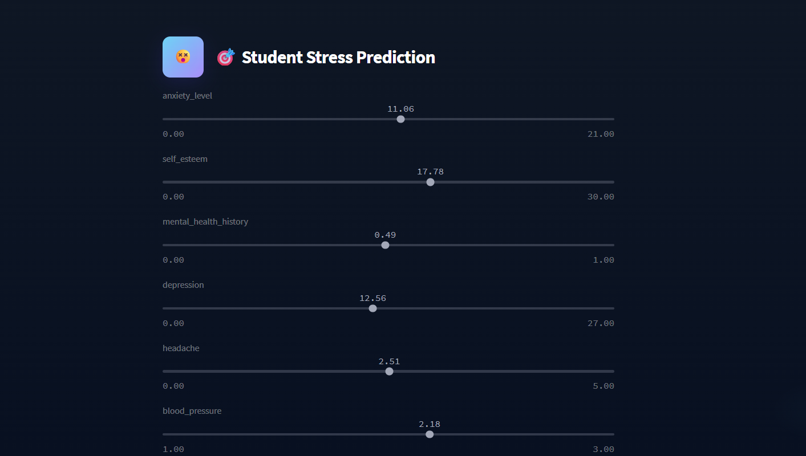
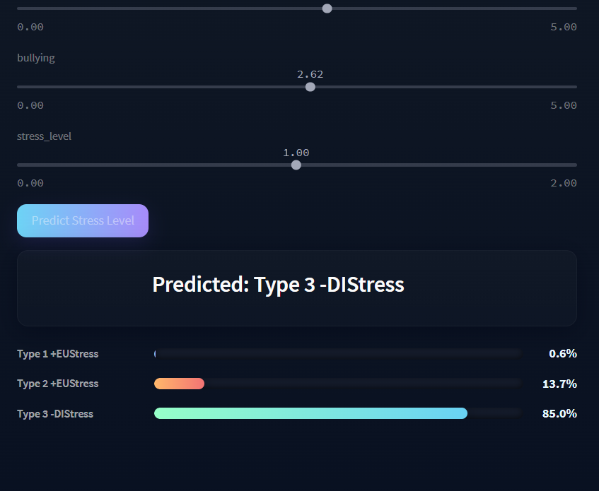

---

# 🎓 Student Stress Level Prediction

A **Streamlit-based web application** that predicts a student’s **stress level** (Type 1, Type 2, or Type 3) using a trained machine learning model. The app features a modern UI, slider-based inputs, and probability visualizations for each stress category.

---

## 📌 Features

* **Interactive Sliders** for entering student-related metrics.
* **Clean UI with Custom CSS** for a professional and engaging design.
* **Blue Highlight** for final prediction results.
* **Probability Breakdown** for each stress level type.
* **Responsive Design** for different screen sizes.

---

## 📂 Project Structure

```plaintext
student_stress/
│── app.py                  # Main Streamlit application
│── model.pkl               # Trained machine learning model
│── cleaned_dataset.csv     # Cleaned student stress dataset
│── requirements.txt        # Dependencies
│── SS1.png                 # Screenshot of the app (Home)
│── SS2.png                 # Screenshot of the app (Prediction)
│── README.md               # Project documentation
```

---

## 🛠️ Installation & Setup

1. **Clone the repository**

   ```bash
   git clone https://github.com/yourusername/student_stress_prediction.git
   cd student_stress_prediction
   ```

2. **Install dependencies**

   ```bash
   pip install -r requirements.txt
   ```

3. **Run the application**

   ```bash
   streamlit run app.py
   ```

4. Open your browser at

   ```
   http://localhost:8501
   ```

---

## 📊 Dataset

The dataset used was **cleaned** to remove missing and duplicate values. It contains various features that contribute to predicting a student's stress level.
Stress levels are categorized as:

* **Type 1** – Low stress
* **Type 2** – Moderate stress
* **Type 3** – High stress

---

## 🧠 Model Details

The model is trained using a **supervised machine learning algorithm** on the cleaned dataset.
The final model (`model.pkl`) is loaded in the app to make predictions.

---

## 🎨 UI Customization

* Custom **CSS** for enhanced visuals.
* **App logo** placeholder included; can be replaced with your own image inside the `.app-logo` div.
* Sliders for smooth input control.

---

## 📷 Screenshots

### 🏠 Home Page



### 📈 Prediction Page



---

## 📧 Author

**Mohammed Abu hurer**
📩 [mohammedabuhurer@gmail.com](mailto:mohammedabuhurer@gmail.com)

---

## 📜 License

This project is licensed under the **MIT License** – see the [LICENSE](LICENSE) file for details.

---
